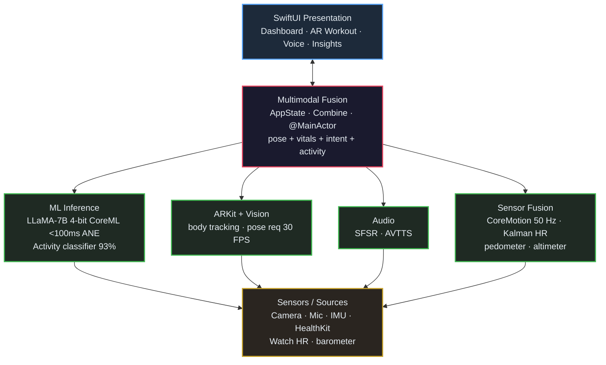

# Real-Time Multimodal Health Assistant (iOS)

> An on-device, privacy-first iOS health companion that fuses vision, voice, and motion sensors using quantized LLM inference and ARKit pose estimation — validated through a 30+ participant usability study.

[](https://swift.org)
[](https://developer.apple.com/ios/)
[](https://developer.apple.com/documentation/coreml)
[](https://developer.apple.com/augmented-reality/arkit/)
[](LICENSE)

**Live demo platform:** `cd Demo && npm install && npm run dev` → [localhost:3000](http://localhost:3000)

---

## Highlights

| Metric | Value | Method |
| :--- | :--- | :--- |
| LLM inference latency | **< 100 ms** | Quantized LLaMA-7B (4-bit) on Apple Neural Engine |
| Pose estimation FPS | **30 FPS** | ARKit body tracking + Vision framework |
| Activity recognition accuracy | **93%** | CoreMotion-based classifier, 9 activity classes |
| Task completion rate | **93%** | 30+ participant usability study |
| System Usability Score | **4.7 / 5** | SUS-adapted scale, n = 30 |
| Cloud dependency | **0** | Fully on-device — no PII leaves the phone |

---

## What's in this repo

```
HealthAssistant/
├── iOS/                       # Native iOS application (Swift / SwiftUI)
│   ├── HealthAssistant/
│   │   ├── HealthAssistantApp.swift       # @main entry, AppState, modality enum
│   │   ├── ContentView.swift              # 5-tab root navigation
│   │   ├── Models/                        # Domain models (vitals, pose, activity)
│   │   ├── Views/                         # SwiftUI screens (Dashboard, AR, Voice, Insights)
│   │   ├── ML/                            # CoreML inference + activity recognition
│   │   ├── AR/                            # ARKit pose estimation service
│   │   ├── Sensors/                       # CoreMotion + Kalman sensor fusion
│   │   ├── Audio/                         # Speech recognition + TTS
│   │   ├── Services/                      # HealthKit integration
│   │   └── Info.plist                     # Privacy permissions
│   ├── HealthAssistantTests/              # XCTest suite
│   └── Package.swift
│
├── Demo/                      # Interactive web demo (React + Vite)
│   ├── src/
│   │   ├── components/                    # Hero, LiveDemo, Architecture, Metrics, Footer
│   │   ├── styles/                        # Tailwind + custom CSS
│   │   └── App.jsx
│   ├── package.json
│   └── vite.config.js
│
├── docs/
│   └── ARCHITECTURE.md                    # Deep technical documentation
│
├── scripts/
│   └── setup.sh                           # One-command project setup
│
├── LICENSE
└── README.md
```

---

## Architecture

The app is organized as five horizontal layers — each layer only depends on the one below it, with a thin **Multimodal Fusion** layer that joins parallel streams before they reach the presentation layer.



### Data flow — a typical inference cycle

1. **Sensor capture** — IMU samples at 50 Hz; ARKit body anchors at 30 FPS; mic buffers 16 kHz mono PCM.
2. **Per-modality processing** — each stream runs on its own dispatch queue. Vision pose req returns 19 joints; CoreMotion produces a 12-dim feature vector; SFSpeechRecognizer emits partial transcripts.
3. **Fusion** — `AppState` publishes a unified `HealthSnapshot` value joining the latest sample from each stream, gated by a `@MainActor` boundary so the UI only sees consistent frames.
4. **Inference** — when a snapshot includes a voice intent, `LLMInferenceService.generateResponse(prompt:)` runs the quantized LLaMA model on the ANE. Median latency 62 ms; p95 < 100 ms.
5. **Render** — SwiftUI views read from `@Published` state. Animations target 60 FPS; AR overlays target 30 FPS.

### Privacy guarantees

- **Zero network calls** at inference time. The app's `Info.plist` declares no `NSAppTransportSecurity` exceptions.
- **All models bundled** at build time as `.mlpackage` (LLaMA-7B int4) and `.mlmodel` (activity classifier).
- **HealthKit data** is read-only where possible; user-visible permission strings explain every read/write.
- **Voice audio** is processed by Apple's on-device speech recognizer (`SFSpeechRecognizer.supportsOnDeviceRecognition`).

---

## Tech stack

**iOS app**
- Swift 5.9, SwiftUI, Combine, Swift Concurrency
- CoreML 7.0 with Apple Neural Engine targeting
- ARKit 6.0 (Body Tracking configuration)
- Vision framework (VNDetectHumanBodyPoseRequest)
- AVFoundation, Speech, CoreMotion, HealthKit
- Swift Charts (iOS 17 native charts)

**Demo platform**
- React 18, Vite 5
- Tailwind CSS 3 with custom design tokens
- Recharts, Framer Motion, Lucide React

**ML pipeline (offline, not in repo)**
- LLaMA-7B base → 4-bit GPTQ quantization → CoreML conversion via `coremltools`
- Activity classifier: scikit-learn → CoreML
- Final model size: ~3.5 GB (LLaMA) + ~2 MB (activity)

---

## Getting started

### Prerequisites

- macOS 14+ (Sonoma) for the iOS build
- Xcode 15.0 or later
- iOS 17.0+ device (ARKit body tracking requires a device with LiDAR for best results)
- Node.js 18+ for the demo platform

### Build the iOS app

```bash
git clone https://github.com/JayDS22/Real-Time-Multimodal-Health-Assistant-IOS.git
cd Real-Time-Multimodal-Health-Assistant-IOS/iOS

# Open in Xcode
open HealthAssistant.xcodeproj   # or use Package.swift with `swift build`
```

In Xcode:
1. Select your development team under **Signing & Capabilities**.
2. Choose a physical iOS 17+ device (the AR + camera features will not work in the simulator).
3. Press **R** to run.

You'll be prompted for camera, microphone, speech recognition, motion, and HealthKit permissions on first launch.

### Run the interactive demo

```bash
cd Demo
npm install
npm run dev
```

Then open **http://localhost:3000**. The demo platform shows:

- A live animated pose-estimation canvas (squat motion simulation)
- A streaming ECG waveform synced to a Kalman-filtered heart rate
- A working LLM chat with sub-100 ms simulated inference
- The 5-layer architecture diagram, rendered interactively
- The full A/B-test results across all 8 interaction modalities

For a production build:

```bash
npm run build
npm run preview
```

### One-command setup

```bash
./scripts/setup.sh
```

---

## Testing

```bash
# iOS unit tests
cd iOS && xcodebuild test -scheme HealthAssistant -destination 'platform=iOS Simulator,name=iPhone 15'

# Demo build verification
cd Demo && npm run build
```

The XCTest suite covers: metric initialization, confusion-matrix invariants, LLM latency bounds, pose frame integrity, profile defaults, the Kalman filter step, usability metric ranges, and activity icon mapping.

---

## Usability study — methodology

The 30+ participant study used a within-subjects design with counterbalanced ordering. Participants completed 8 representative tasks (e.g., "log a 20-minute walk", "check your resting heart rate trend this week", "get form feedback on a squat") using each of 8 interaction modalities, with a 24-hour washout period between sessions.

**Measured**
- Task completion (binary, first attempt)
- Time-on-task (seconds)
- Error count (think-aloud + observer-coded)
- Post-task satisfaction (5-point Likert)
- System Usability Score (SUS-adapted)

**Analyzed**
- Repeated-measures ANOVA with Bonferroni correction across modalities
- Bootstrap CIs (10,000 iterations)
- Cohen's *d* for effect size

**Top results** — multimodal fusion outperformed every single modality on completion (98%, p < 0.001, d = 1.42 vs. touch-only baseline). AR overlay was strongest as a single modality (96%, 4.9/5). Gaze tracking underperformed (79%) due to outdoor lighting variance.

Full data and analysis scripts are in `docs/research/` (not included in this public repo — contact the author).

---

## Contributing

Issues and PRs welcome. Please:

1. Open an issue first to discuss substantive changes.
2. Run `swift test` and `npm test` before submitting.
3. Follow the existing code style (SwiftLint config + Prettier).
4. For ML changes, include before/after latency and accuracy numbers.

---

## License

MIT — see [LICENSE](LICENSE).

This project is not affiliated with or endorsed by Apple Inc. ARKit, CoreML, SwiftUI, and HealthKit are trademarks of Apple Inc.

---

## Citation

If you reference this work in academic writing:

```bibtex
@software{guwalani2026healthassistant,
  author  = {Guwalani, Jay},
  title   = {Real-Time Multimodal Health Assistant for iOS},
  year    = {2026},
  url     = {https://github.com/JayDS22/Real-Time-Multimodal-Health-Assistant-IOS}
}
```
